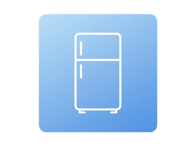

#  Fridge Dashboard

 

A tiny Python/Flask web server that renders a single full-screen dashboard for an old tablet
mounted on a fridge.

<div align="center">
  <table>
    <tr>
      <td></td>
      <td></td>
    </tr>
  </table>
</div>

The HTML/CSS/JS are deliberately minimal so they render on old browswers like Safari 9. 
The whole page meta-refreshes every minute to pull fresh sensor values, and a ~10-line ES5
script keeps the clock ticking between refreshes.

## Install as a Home Assistant add-on

This repo is a Home Assistant **add-on repository**. Add-ons are installed from the
**Add-on Store**.

[](https://my.home-assistant.io/redirect/supervisor_add_addon_repository/?repository_url=https%3A%2F%2Fgithub.com%2FFI-153%2FFridge-Dashboard)

1. Click the badge above (or **Settings → Add-ons → Add-on Store → ⋮ → Repositories** and
   paste `https://github.com/FI-153/Fridge-Dashboard`).
2. "Fridge Dashboard" appears in the store. Open it and click **Install**.
3. On the **Configuration** tab, set the three sensors (`entity_temperature`,
   `entity_humidity`, `entity_power`) and optionally the refresh interval, then **Start**.
4. On the tablet, open `http://<home-assistant-ip>:6123/`.

Changing the sensors later is just editing those fields and restarting the add-on. If port
6123 is already in use, remap it under the add-on's **Network** panel to any free host port.

## Configuration

All configuration is via environment variables. Copy `.env.example` to `.env` and fill it in:

| Variable                        | Required | Default | Purpose                                  |
| ------------------------------- | -------- | ------- | ---------------------------------------- |
| `HASS_IP`                       | yes\*    | —       | Home Assistant host/IP                   |
| `HASS_PORT`                     | yes\*    | —       | Home Assistant port                      |
| `HASS_TOKEN`                    | yes      | —       | Long-lived access token                  |
| `ENTITY_TEMPERATURE`            | yes      | —       | Temperature sensor entity ID             |
| `ENTITY_HUMIDITY`               | yes      | —       | Humidity sensor entity ID                |
| `ENTITY_POWER`                  | no       | —       | Power sensor entity ID; empty → clock fills the left column |
| `HASS_URL`                      | no       | —       | Full API base (`…/api/`); if set, replaces `HASS_IP`/`HASS_PORT` |
| `THEME`                         | no       | `dark`  | Color theme: `dark` or `light`           |
| `PAGE_REFRESH_INTERVAL_SECONDS` | no       | `60`    | Whole-page refresh interval (seconds)    |
| `SERVER_PORT`                   | no       | `6123`  | Port the dashboard is served on          |

\* `HASS_IP`/`HASS_PORT` are only needed when `HASS_URL` is not set. As a Home Assistant
add-on the app talks to Core through the Supervisor proxy, so none of the connection
variables are configured by hand — only the sensors (see below).

Units (°C, %, W, …) are read from each entity's Home Assistant `unit_of_measurement`
attribute, so nothing is hardcoded. If a sensor can't be read, its card shows `--`; if
Home Assistant is entirely unreachable, an offline page is shown and the dashboard recovers
automatically on the next refresh.

## Deploying as a standalone service (not as add-on)

The image is configured entirely through **runtime environment variables** — there is no
baked-in config and **no `.env` file is required**. Provide the variables whichever way suits
you.

**A. Run the image directly** (e.g. after pulling/loading it):

```bash
docker run -d --name fridge_dashboard -p 6123:6123 \
  -e HASS_IP=192.168.1.10 \
  -e HASS_PORT=8123 \
  -e HASS_TOKEN=your-long-lived-token \
  -e ENTITY_TEMPERATURE=sensor.fridge_temperature \
  -e ENTITY_HUMIDITY=sensor.fridge_humidity \
  -e ENTITY_POWER=sensor.fridge_power \
  fridge-dashboard
```

**B. Docker Compose.** The bundled `docker-compose.yaml` reads the variables from your shell
(or an optional `.env` in the directory, which Compose auto-loads) and applies sensible
defaults for the optional ones, so it works with or without a `.env`:

```bash
export HASS_IP=192.168.1.10 HASS_PORT=8123 HASS_TOKEN=... \
  ENTITY_TEMPERATURE=sensor.fridge_temperature \
  ENTITY_HUMIDITY=sensor.fridge_humidity \
  ENTITY_POWER=sensor.fridge_power
make docker-up              # build + run in the background
```

Or just drop the values into your own `compose.yaml` under `environment:`. The container's
launch command lives in `entrypoint.sh`.

The dashboard is then available at `http://<host>:<SERVER_PORT>/`.
Stop it with `make docker-down`. A liveness probe is exposed at `/health`.

## Local development

Dependencies are managed with [uv](https://docs.astral.sh/uv/).

```bash
make setup    # create the virtualenv and install deps (uv sync)
make test     # run the test suite
make lint     # ruff lint + format check
make format   # auto-fix + format
```

To run the dev server locally:

```bash
make debug    # loads ./.env if present, then runs the Flask dev server in the terminal
make run      # runs the Flask dev server (expects the variables already exported)
```

## Built with AI

This software was developed with strong assistance from Claude (Opus and other Anthropic
models), with humans leading the ideas, testing, and debugging. I say this openly because
it shaped how the project was built. If you are not happy with AI-developed code, this 
software is not for you.